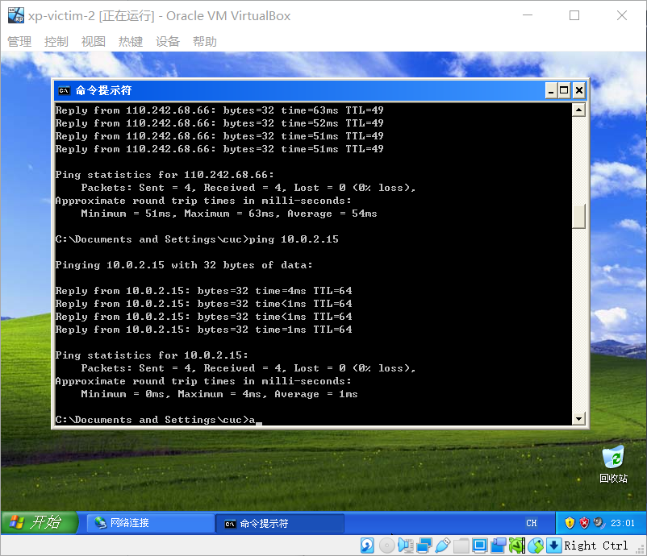

# 基于 VirtualBox 的网络攻防基础环境搭建

### 实验目的

- 掌握 VirtualBox 虚拟机的安装与使用；
- 掌握 VirtualBox 的虚拟网络类型和按需配置；
- 掌握 VirtualBox 的虚拟硬盘多重加载

### 实验环境

- VirtualBox 虚拟机
- 攻击者主机（Attacker）：Kali
- 网关（Gateway, GW）：Debian
- 靶机（Victim）：Debian / xp-sp3 / Kali

### 实验要求

* 虚拟硬盘配置成多重加载

* 搭载满足如下拓扑图所示的虚拟机网络拓扑

  

* 完成以下网络的连通性测试：

  * 靶机可以直接访问攻击者主机
  * 攻击者主机无法直接访问靶机
  * 网关可以直接访问攻击者主机和靶机
  * 靶机的所有对外上下行流量必须经过网关
  * 所有节点均可以访问互联网

### 实验步骤

#### 虚拟硬盘配置成多重加载

* 在"管理" -> "虚拟介质管理" -> "属性"中，点击"类型"，可以更改所选虚拟硬盘的加载类型

  

#### 搭载虚拟机网络拓扑

* 给虚拟机debian-gw(网关)配置四个虚拟网卡

  

* 分别给靶机和攻击者主机分配网卡

* 各主机ip地址如下

  | 虚拟机          | IP地址         |
  | --------------- | -------------- |
  | kali_attacker   | 10.0.2.15      |
  | kali-victim-1   | 172.16.111.132 |
  | xp-victim-1     | 172.16.111.125 |
  | xp-victim-2     | 172.16.222.142 |
  | debian-victim-2 | 172.16.222.120 |

#### 连通性测试

* 靶机可以直接访问攻击者主机

  

* 攻击者主机无法直接访问靶机

  

* 网关可以直接访问攻击者主机和靶机

  * 网关直接访问靶机

    

  * 网关直接访问攻击者

    

* 靶机的所有对外上下行流量必须经过网关

  * 在网关上使用tcpdump命令对enp0s10(172.16.222.1)进行监听

  * 在靶机xp-victim-2(172.16.222.142)上对攻击者主机(10.0.2.15)发出ping请求

  * 网关抓包情况如下
    

  * 在靶机上使用tracert访问baidu.com

    

    

* 所有节点均可以访问互联网

  * 网关
    

  * 靶机kali-victim-1访问互联网

    

  * 靶机xp-victim-1访问互联网

    

  * 靶机xp-victim-2访问互联网

    

  * 靶机debian-victim-2访问互联网
    

  * 攻击者主机访问互联网

    

  

  

  

  