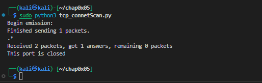

# 基于Scapy编写端口扫描器

## 实验环境

* python + scapy
* 网络拓扑
  
## 实验要求

* 禁止探测互联网上的 IP ，严格遵守网络安全相关法律法规
* 完成以下扫描技术的编程实现
  * TCP connect scan / TCP stealth scan

  * TCP Xmas scan / TCP fin scan / TCP null scan

  * UDP scan
* 上述每种扫描技术的实现测试均需要测试端口状态为：开放、关闭 和 过滤 状态时的程序执行结果
* 提供每一次扫描测试的抓包结果并分析与课本中的扫描方法原理是否相符？如果不同，试分析原因；
* 在实验报告中详细说明实验网络环境拓扑、被测试 IP 的端口状态是如何模拟的
* （可选）复刻 nmap 的上述扫描技术实现的命令行参数开关

## 实验过程

### 端口状态

* open
  * ``` sudo iptables -I INPUT -p tcp --dport 1084 -j ACCEPT ```将防火墙规则设定为ACCEPT，允许数据包通过
  * 在靶机上运行``` nc -l -p 1084 ```对1084端口进行监听
  

* close
  * 不运行``` nc -l -p 1084 ```，在防火墙规则不变的情况下关闭1084端口
  

* filterd
  * ``` sudo iptables -I INPUT -p tcp --dport 1084 -j DROP ```将防火墙规则设定为ACCEPT，丢弃数据包
  * 在靶机上运行``` nc -l -p 1084 ```对1084端口进行监听

### TCP connect scan/TCP stealth scan

* Tcp connect scan
  * code
  ```
  #! /usr/bin/python

    from scapy.all import *

    dst_ip = "172.16.111.132"
    dst_port=1084

    #pkts=ans
    pkts = sr1(IP(dst=dst_ip) / TCP(dport=1084, flags="S"), timeout=1)
    if pkts is None:
	print("This port is filtered")
    elif(pkts.haslayer(TCP)):
	    if(pkts.getlayer(TCP).flags == 0x12):#0x12==syn/ack
        sr1(IP(dst=dst_ip) / TCP(dport=1084, flags="AR"), timeout=1)
		print("This port is open")
	    elif (pkts.getlayer(TCP).flags == 0x14):#0x14==rst/ack
        sr1(IP(dst=dst_ip) / TCP(dport=1084, flags="R"), timeout=1)
		print("This port is closed")

  ```
  * open
    * 靶机port status
    
    * 扫描结果
    
    * 抓包分析
    

  * closed
    * 靶机port status
    
    * 扫描结果
    
    * 抓包分析
    
  * filterd
    * 扫描结果
    
    * 抓包分析
    
  
* Tcp stealth scan
  * code
  ```
    #! /usr/bin/python

    from scapy.all import *

    dst_ip="172.16.111.132"
    src_port=RandShort()
    dst_port=1084

    rcv=sr1(IP(dst=dst_ip)/TCP(dport=dst_port,flags="S"),timeout=10)

    if(rcv is None):
        print("This port is filterd with no response")
    elif(rcv.haslayer(TCP)):
        if(rcv.getlayer(TCP).flags == 0x12):
            sr1(IP(dst=dst_ip)/TCP(dport=dst_port,flags="R"),timeout=10)
            print("This port is open")
        elif(rcv.getlayer(TCP).flags == 0x14):
            print("This port is closed")
    elif(rcv.haslayer(ICMP)):
        print("This port is filterd with ICMP received")
  ```
  * open
    * 靶机port status
    
    * 扫描结果
    
    * 抓包分析
    
  * closed
    * 靶机port status
    
    * 扫描结果
    
    * 抓包分析
    
  * filterd
    * 扫描结果
    
    * 抓包分析
    

### TCP Xmas scan / TCP fin scan / TCP null scan

* TCP Xmas scan
  * code
  ```
  #! /usr/bin/python

    from scapy.all import *

    dst_ip = "172.16.111.132"
    src_port = RandShort()
    dst_port=1084


    rcv=sr1(IP(dst=dst_ip)/TCP(dport=dst_port,flags="FPU"),timeout=10)

    if (rcv is None):
        print("This port is open or filtered with no response")
    elif(rcv.haslayer(TCP)):
        if(rcv.getlayer(TCP).flags == 0x14):
            print("This port is closed")
    elif(rcv.haslayer(ICMP)):
        print("This port is open or filtered with ICMP received")
  ```
  * open 
    * 靶机port status
    
    * 扫描结果
    
    * 抓包分析
    
  * closed
    * 靶机port status
    
    * 扫描结果
    
    * 抓包分析
    
  * filterd
    * 扫描结果
    
    * 抓包分析
    
* TCP fin scan
  * code
  ```
  #! /usr/bin/python

    from scapy.all import *

    dst_ip = "172.16.111.132"
    src_port = RandShort()
    dst_port=1084


    rcv=sr1(IP(dst=dst_ip)/TCP(dport=dst_port,flags="F"),timeout=10)

    if (rcv is None):
        print("This port is open or filtered with no response")
    elif(rcv.haslayer(TCP)):
        if(rcv.getlayer(TCP).flags == 0x14):
            print("This port is closed")
    elif(rcv.haslayer(ICMP)):
        print("This port is open or filtered with ICMP received")
  ```
  * open 
    * 扫描结果
    
    * 抓包分析
    
  * closed
    * 扫描结果
    
    * 抓包分析
    
  * filterd
    * 扫描结果
    
    * 抓包分析
    

* TCP null scan
  * code
  ```
  #! /usr/bin/python

    from scapy.all import *

    dst_ip = "172.16.111.132"
    src_port = RandShort()
    dst_port=1084


    rcv=sr1(IP(dst=dst_ip)/TCP(dport=dst_port,flags=""),timeout=10)

    if (rcv is None):
        print("This port is open or filtered with no response")
    elif(rcv.haslayer(TCP)):
        if(rcv.getlayer(TCP).flags == 0x14):
            print("This port is closed")
    elif(rcv.haslayer(ICMP)):
        print("This port is open or filtered with ICMP received")
  ```
  * open
    * 扫描结果
    
    * 抓包分析
    
  * closed
    * 扫描结果
    
    * 抓包分析
    
  * filterd
    * 扫描结果
    
    * 抓包分析
    

### UDP scan
* code
```
#! /usr/bin/python

from scapy.all import *

dst_ip = "172.16.111.132"
src_port = RandShort()
dst_port=53


rcv=sr1(IP(dst=dst_ip)/UDP(dport=dst_port),timeout=10)

if (rcv is None):
	print("This port is open ,closed or filtered with no response")
elif(rcv.haslayer(UDP)):
	print("This port is open")
elif(rcv.haslayer(ICMP)):
	print("This port is closed")
```

* open
  * 端口状态
  
  * 扫描结果
  
  * 抓包分析
  

* closed
 * 端口状态
 
 * 扫描结果
 
 * 抓包分析
 

 * filterd
 * 端口状态
 
 * 扫描结果
 
 * 抓包分析
 

 ### 参考链接
 [Opening a port on Linux](https://www.digitalocean.com/community/tutorials/opening-a-port-on-linux)
 
 [Using Scapy with Python](https://santandergto.com/en/guide-using-scapy-with-python/)

 [iptables instruction](https://www.digitalocean.com/community/tutorials/how-to-list-and-delete-iptables-firewall-rules)