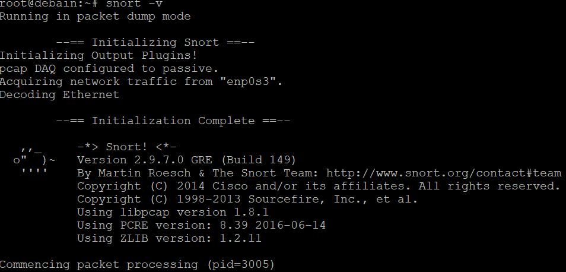
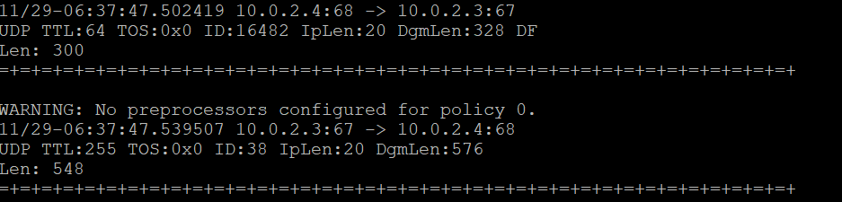
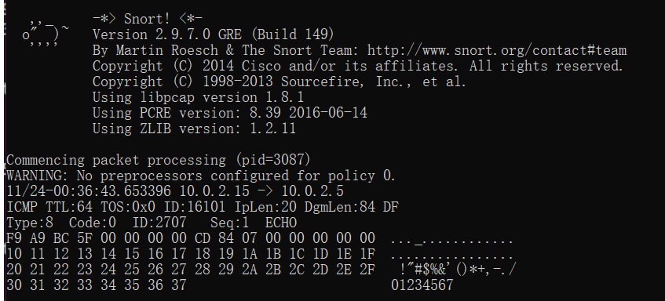
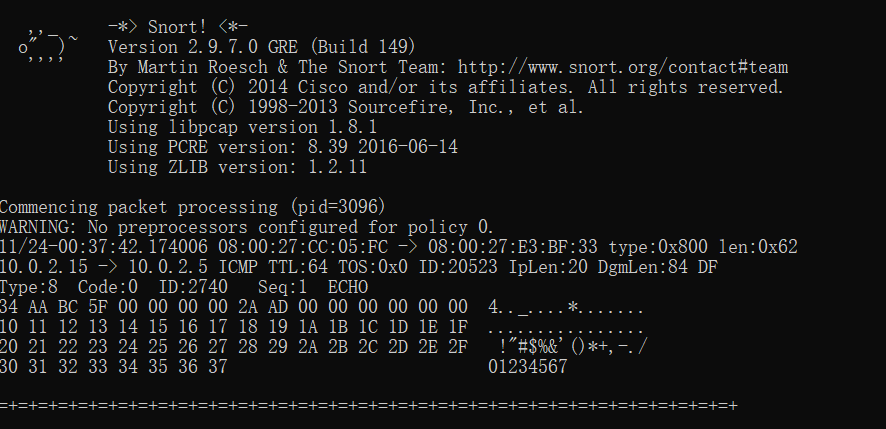
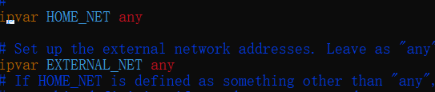
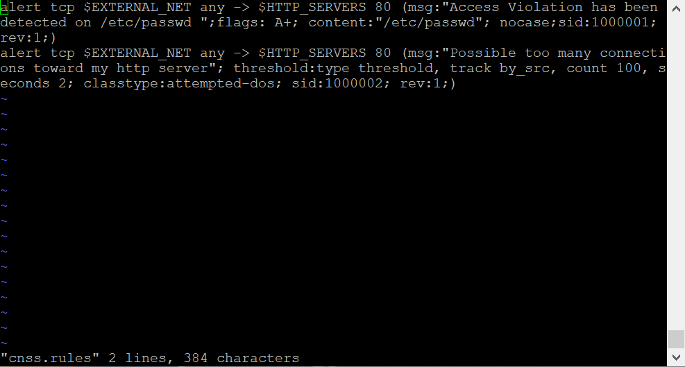
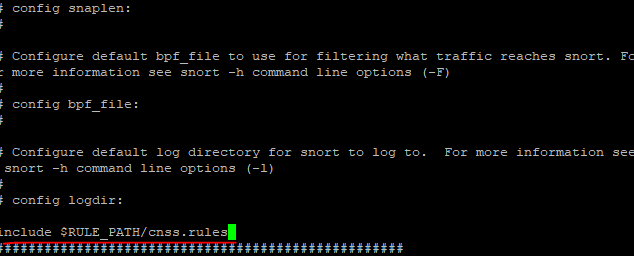

# 第九章实验报告

## 实验要求

* 通过配置snort不同规则来进行网络入侵检测

## 实验环境

* debian:NAT network
* snort
* pfstp
  
## 实验过程

### 实验一：配置snort为嗅探模式

安装snort
```
# 禁止在apt安装时弹出交互式配置界面
export DEBIAN_FRONTEND=noninteractive
# 安装snort
apt install snort
# 开启测试模式测试snort配置
snort -T -c /etc/snort/snort.conf
```

配置snort为嗅探模式
```
# 显示IP/TCP/UDP/ICMP头
snort –v

# 显示应用层数据
snort -vd

# 显示数据链路层报文头
snort -vde

# -b 参数表示报文存储格式为 tcpdump 格式文件
# -q 静默操作，不显示版本欢迎信息和初始化信息
snort -q -v -b -i enp0s8 "port not 22"

# 使用 CTRL-C 退出嗅探模式
# 嗅探到的数据包会保存在 /var/log/snort/snort.log.<epoch timestamp>
# 其中<epoch timestamp>为抓包开始时间的UNIX Epoch Time格式串
# 可以通过命令 date -d @<epoch timestamp> 转换时间为人类可读格式
# exampel: date -d @1511870195 转换时间为人类可读格式
# 上述命令用tshark等价实现如下：
tshark -i enp0s8 -f "port not 22" -w 1_tshark.pcap
```

显示ICMP头




显示应用层数据



显示数据链路层报文头



使用`snort -q -v -b -i enp0s8 "port not 22"`保存嗅探数据
### 实验二 配置并启用snort内置规则

```
# 正确定义HOME_NET 和 EXTERNAL_NET，处于学习与实验目的将之设为any
vim /etc/snort/snort.conf
# 启用snort内置规则
snort -q -A console -b -i enp0s8 -c /etc/snort/snort.conf -l /var/log/snort/
```



输入`snort -q -A console -b -i enp0s8 -c /etc/snort/snort.conf -l /var/log/snort/`启用内置规则

### 实验三：自定义snort规则
```
# 新建自定义 snort 规则文件
cat << EOF > /etc/snort/rules/cnss.rules
alert tcp \$EXTERNAL_NET any -> \$HTTP_SERVERS 80 (msg:"Access Violation has been detected on /etc/passwd ";flags: A+; content:"/etc/passwd"; nocase;sid:1000001; rev:1;)
alert tcp \$EXTERNAL_NET any -> \$HTTP_SERVERS 80 (msg:"Possible too many connections toward my http server"; threshold:type threshold, track by_src, count 100, seconds 2; classtype:attempted-dos; sid:1000002; rev:1;)
EOF

# 添加配置代码到 /etc/snort/snort.conf
include $RULE_PATH/cnss.rules
snort -q -A fast -b -i enp0s3 -c /etc/snort/snort.conf -l /var/log/snort/
```


